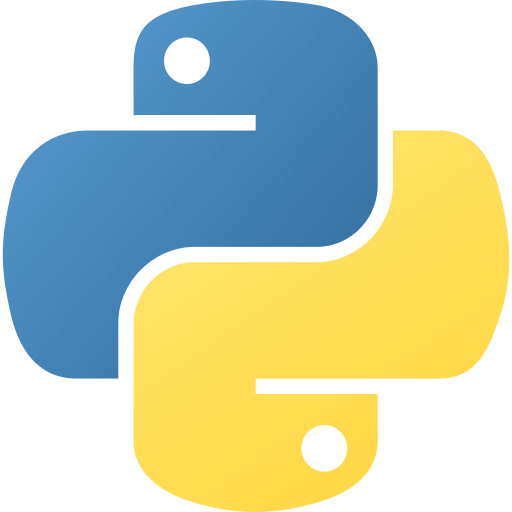
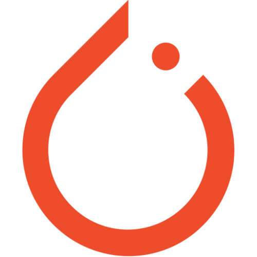
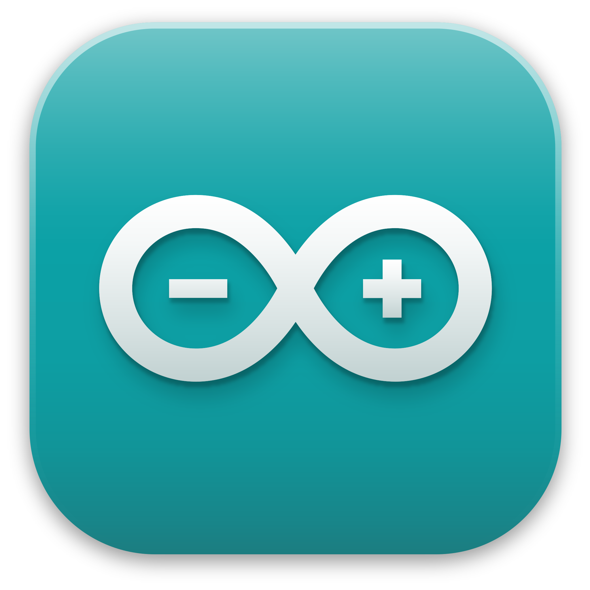

# 👋 Hi, I'm Lorenzo Cardoni

I graduated at **Università Politecnica delle Marche (UNIVPM)**:
- **Bachelor’s Degree** in Computer and Automation Engineering  
- **Master’s Degree** in Computer and Automation Engineering  

My academic journey focused on **Artificial Intelligence**, with particular interest in **Data Science** and the **integration of Deep Learning models on embedded systems**.

---

### 🏆 Competitions
During my studies, I had the opportunity to participate in several competitions:

- **Bosch Future Mobility Challenge 2023**  
  Developed AI solutions for a 1:10 scale autonomous car, including recognition of street signs, pedestrians, and road lanes.  

- **UNIVPM Hackathon 2023**  
  Designed a website concept to help large events manage crowd flow and improve safety.  

- **UNIVPM Hackathon 2024**  
  Created the idea of a social robot capable of interacting with people in a city center while collecting rubbish along its path.  

---

## 🔧 Technologies & Tools

### 🖥️ Programming Languages

     &nbsp;&nbsp;
     &nbsp;&nbsp;
     

### 🛠️ Frameworks & Libraries

     &nbsp;&nbsp;
     &nbsp;&nbsp;
         

### ⚙️ Tools & Other Technologies

     &nbsp;&nbsp;
     &nbsp;&nbsp;
         

<!--
**Lorenzo-Cardoni/Lorenzo-Cardoni** is a ✨ _special_ ✨ repository because its `README.md` (this file) appears on your GitHub profile.

Here are some ideas to get you started:

- 🔭 I’m currently working on ...
- 🌱 I’m currently learning ...
- 👯 I’m looking to collaborate on ...
- 🤔 I’m looking for help with ...
- 💬 Ask me about ...
- 📫 How to reach me: ...
- 😄 Pronouns: ...
- ⚡ Fun fact: ...
-->
