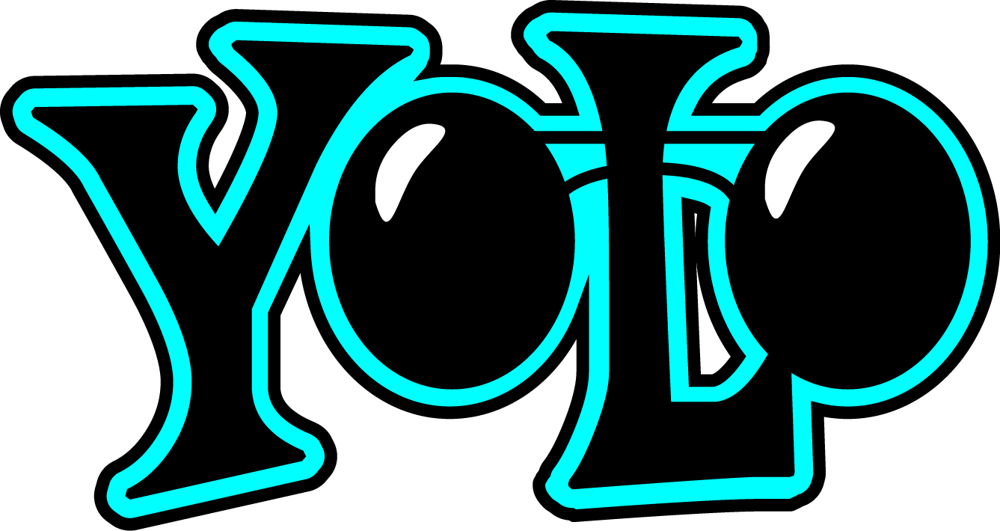

# 👋 Hi, I'm Lorenzo Cardoni

I graduated at **Università Politecnica delle Marche (UNIVPM)**:
- **Bachelor’s Degree** in Computer and Automation Engineering  
- **Master’s Degree** in Computer and Automation Engineering  

My academic journey focused on **Artificial Intelligence**, with particular interest in **Machine Learning**, **Deep Learning** and **Data Science**.
I have also studied hardware, such as microcontrollers, sensors, and motors.

---

### 🏆 Competitions
During my studies, I had the opportunity to participate in several competitions:

- **Bosch Future Mobility Challenge 2023**  
  Developed AI solutions for a 1:10 scale autonomous car, including recognition of street signs, pedestrians, and road lanes.  

- **UNIVPM Hackathon 2023**  
  Designed a website concept to help large events manage crowd flow and improve safety.  

- **UNIVPM Hackathon 2024**  
  Created the idea of a social robot capable of interacting with people in a city center while collecting rubbish along its path.  

---

## 🔧 Technologies & Tools

  <table>
    <tr>
      <th>🖥️ Programming Languages</th>
      <th>🛠️ Frameworks & Libraries</th>
      <th>⚙️ Tools & Other Technologies</th>
    </tr>
    <tr>
      <td>
        

         &nbsp;&nbsp;
       &nbsp;&nbsp;
      <a href="https://en.wikipedia.org/wiki/C_(programming_language)">
          
        

      </td>
      <td>
        

         &nbsp;&nbsp;
     &nbsp;&nbsp; 
           &nbsp;&nbsp;
       &nbsp;&nbsp;
       &nbsp;&nbsp;
          <a href="https://it.mathworks.com/products/simulink">
          
      

      </td>
      <td>
        

         &nbsp;&nbsp;
       &nbsp;&nbsp;
          <a href="https://www.microsoft.com/it-it/sql-server">
          
            

      </td>
    </tr>
  </table>

<!--
**Lorenzo-Cardoni/Lorenzo-Cardoni** is a ✨ _special_ ✨ repository because its `README.md` (this file) appears on your GitHub profile.

Here are some ideas to get you started:

- 🔭 I’m currently working on ...
- 🌱 I’m currently learning ...
- 👯 I’m looking to collaborate on ...
- 🤔 I’m looking for help with ...
- 💬 Ask me about ...
- 📫 How to reach me: ...
- 😄 Pronouns: ...
- ⚡ Fun fact: ...
-->
