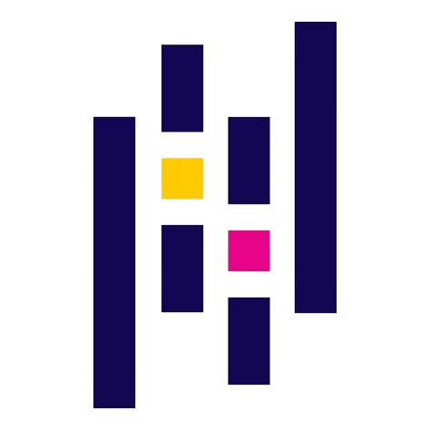

# 👋 Hi, I'm Lorenzo Cardoni

I graduated at **Università Politecnica delle Marche (UNIVPM)**:
- **Bachelor’s Degree** in Computer and Automation Engineering  
- **Master’s Degree** in Computer and Automation Engineering  

My academic journey focused on **Artificial Intelligence**, with particular interest in **Machine Learning**, **Deep Learning** and **Data Science**.
I have also studied hardware, such as microcontrollers, sensors, and motors.

---

### 🏆 Competitions
During my studies, I had the opportunity to participate in several competitions:

- **Bosch Future Mobility Challenge 2023**  
  Developed AI solutions for a 1:10 scale autonomous car, including recognition of street signs, pedestrians, and road lanes.  

- **UNIVPM Hackathon 2023**  
  Designed a website concept to help large events manage crowd flow and improve safety.  

- **UNIVPM Hackathon 2024**  
  Created the idea of a social robot capable of interacting with people in a city center while collecting rubbish along its path.  

---

## 🔧 Technologies & Tools

| 🖥️ Programming Languages | 🛠️ Frameworks & Libraries | Tools & Other Technologies |
| ------------------------- | -------------------------- | --------------------------- |
|   ![Matlab](https://img.shields.io/badge/matlab-orange?style=for-the-badge&logo=data%3Aimage%2Fsvg%2Bxml%3Bbase64%2CPHN2ZyB4bWxucz0iaHR0cDovL3d3dy53My5vcmcvMjAwMC9zdmciIHdpZHRoPSIyMDAiIGhlaWdodD0iMjAwIiB2aWV3Qm94PSIwIDAgMTI4IDEyOCI%2BPGRlZnM%2BPGxpbmVhckdyYWRpZW50IGlkPSJkZXZpY29uTWF0bGFiMCIgeDE9IjE2LjgwMyIgeDI9IjE1LjAxMyIgeTE9IjE2LjYzMSIgeTI9IjIyLjQxMSIgZ3JhZGllbnRUcmFuc2Zvcm09Im1hdHJpeCg0IDAgMCAtNCAwIDEyOCkiIGdyYWRpZW50VW5pdHM9InVzZXJTcGFjZU9uVXNlIj48c3RvcCBvZmZzZXQ9IjAiIHN0b3AtY29sb3I9IiM1MTIiLz48c3RvcCBvZmZzZXQ9Ii4yMyIgc3RvcC1jb2xvcj0iIzUyMyIvPjxzdG9wIG9mZnNldD0iLjM2IiBzdG9wLWNvbG9yPSIjNTM0Ii8%2BPHN0b3Agb2Zmc2V0PSIuNTEiIHN0b3AtY29sb3I9IiM2NDUiLz48c3RvcCBvZmZzZXQ9Ii42NiIgc3RvcC1jb2xvcj0iIzU2OCIvPjxzdG9wIG9mZnNldD0iLjg0IiBzdG9wLWNvbG9yPSIjMjlkIi8%2BPC9saW5lYXJHcmFkaWVudD48bGluZWFyR3JhZGllbnQgaWQ9ImRldmljb25NYXRsYWIxIiB4MT0iMjkuNzEiIHgyPSIxMS43MSIgeTE9IjE4Ljk4MyIgeTI9IjE0LjU2MyIgZ3JhZGllbnRUcmFuc2Zvcm09InNjYWxlKDQpIiBncmFkaWVudFVuaXRzPSJ1c2VyU3BhY2VPblVzZSI%2BPHN0b3Agb2Zmc2V0PSIuMDgxIiBzdG9wLWNvbG9yPSIjYzMzIi8%2BPHN0b3Agb2Zmc2V0PSIuMTg5IiBzdG9wLWNvbG9yPSIjZGU1MjM5Ii8%2BPHN0b3Agb2Zmc2V0PSIuMzEzIiBzdG9wLWNvbG9yPSIjZjA2ZTNlIi8%2BPHN0b3Agb2Zmc2V0PSIuNDIxIiBzdG9wLWNvbG9yPSIjZmE4MDQyIi8%2BPHN0b3Agb2Zmc2V0PSIuNSIgc3RvcC1jb2xvcj0iI2ZlODY0MyIvPjxzdG9wIG9mZnNldD0iLjU4IiBzdG9wLWNvbG9yPSIjZmE3ZjQyIi8%2BPHN0b3Agb2Zmc2V0PSIuNjk2IiBzdG9wLWNvbG9yPSIjZWY2YzNlIi8%2BPHN0b3Agb2Zmc2V0PSIuODMzIiBzdG9wLWNvbG9yPSIjZGM0YzM3Ii8%2BPHN0b3Agb2Zmc2V0PSIuOTE2IiBzdG9wLWNvbG9yPSIjY2YzNjMzIi8%2BPC9saW5lYXJHcmFkaWVudD48L2RlZnM%2BPHBhdGggZmlsbD0iIzQ5ZCIgZD0ibTggNzAuMmwzMS44NzktMTIuODhhODIuNjIgODIuNjIgMCAwIDEgMTAuODgzLTExLjhjMi42MzYtMS4zOTkgNy41OTctLjY0MSAxNi42OC0xMS45MThjOC43OTYtMTEgMTEuNTk3LTIwLjQwMyAxNS43MTgtMjAuNDAzYzYuNTIgMCAxMS4zMiAxNC4wODIgMTguNjAyIDM1LjQwM0E0NjEuNzUgNDYxLjc1IDAgMCAwIDEyMCA5Ni40OGMtNy42MDItNy4wODItMTQuMDc4LTE0LjcxOC0yMS40OC0xNC41MmMtNi44OC4xNjEtMTQuNTIgOC4zMjEtMjIuODggMTguODAyQzY5IDEwOS4xNiA2MC4yIDExNC45MjIgNTYuNzYzIDExNC44YzAgMC04Ljg4My0yNS4xMjEtMTYuMzItMjkuMmExMC41NjMgMTAuNTYzIDAgMCAwLTkuNTYzLjc5N0w4IDcwLjE2em0wIDAiLz48cGF0aCBmaWxsPSJ1cmwoI2Rldmljb25NYXRsYWIwKSIgZD0iTTc5LjIgMTYuMDc4Yy0yLjY4IDMuNjAyLTUuOTIgMTAuMjAzLTExLjc2IDE3LjUyNGMtOS4wODIgMTEuMjc3LTE0IDEwLjUyLTE2LjY4IDExLjkxOGE3OC42NzMgNzguNjczIDAgMCAwLTEwLjg4MiAxMS44bDEzLjIgOS42NEM2NC4yOCA1MS42OCA3MC4yOCAzNS4xMjIgNzQuOTYgMjQuMzk5YTU0LjY0OSA1NC42NDkgMCAwIDEgNC4yMzgtOC4zMnptMCAwIi8%2BPHBhdGggZmlsbD0idXJsKCNkZXZpY29uTWF0bGFiMSkiIGQ9Ik04My4yIDEzLjJjLTguNzIgMC0xNC42OCA0NS45MjEtNDYuODggNzEuNTYyYzkuMDQtMS40OCAxNi44OCAyMC45NTcgMjAuNDggMzAuMDM5YzE2LTIuNzIzIDI4LjgwMi0zMy4zMiA0MS43Mi0zMi44NGM3LjQwMi4yNzcgMTMuODc4IDcuNDM3IDIxLjQ4IDE0LjUyQzEwMi42NCA2MCA5NC41MiAxMy4xOTggODMuMiAxMy4xOTh6bTAgMCIvPjwvc3ZnPg%3D%3D&labelColor=black)  
|   

 |

  <table>
    <tr>
      <th>🖥️ Programming Languages</th>
      <th>🛠️ Frameworks & Libraries</th>
      <th>⚙️ Tools & Other Technologies</th>
    </tr>
    <tr>
      <td>
        

         &nbsp;&nbsp;
       &nbsp;&nbsp;
      <a href="https://en.wikipedia.org/wiki/C_(programming_language)">
          
        

      </td>
      <td>
        

         &nbsp;&nbsp;
     &nbsp;&nbsp; 
           &nbsp;&nbsp;
       &nbsp;&nbsp;
       &nbsp;&nbsp;
          <a href="https://it.mathworks.com/products/simulink">
          
      

      </td>
      <td>
        

         &nbsp;&nbsp;
       &nbsp;&nbsp;
          <a href="https://www.microsoft.com/it-it/sql-server">
          
            

      </td>
    </tr>
  </table>

<!--
**Lorenzo-Cardoni/Lorenzo-Cardoni** is a ✨ _special_ ✨ repository because its `README.md` (this file) appears on your GitHub profile.

Here are some ideas to get you started:

- 🔭 I’m currently working on ...
- 🌱 I’m currently learning ...
- 👯 I’m looking to collaborate on ...
- 🤔 I’m looking for help with ...
- 💬 Ask me about ...
- 📫 How to reach me: ...
- 😄 Pronouns: ...
- ⚡ Fun fact: ...
-->
